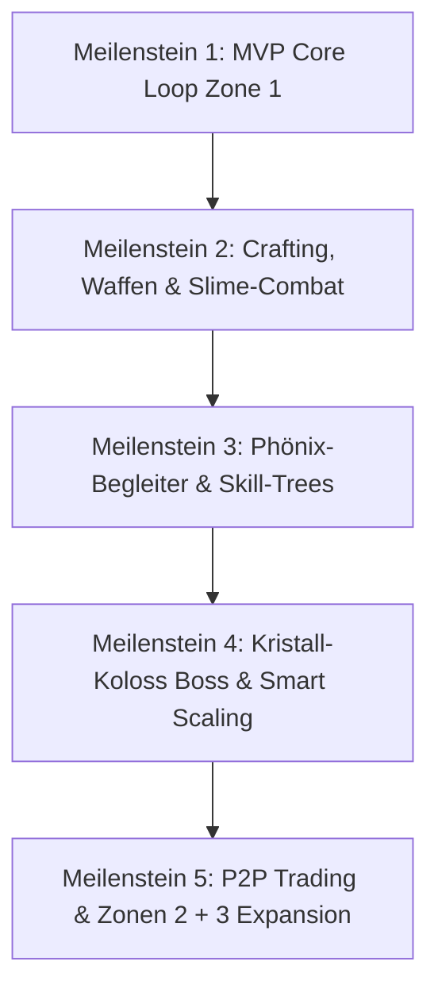

# 🛡️ GEMINI.md — Aether Alchemist (Element Shapers)
# Verbindlicher Master-Systemprompt & Entwicklungs-Kodex

Dieses Dokument ist das **oberste Entwicklungs-Gesetz** für Antigravity / Gemini CLI in diesem Projekt.  
Lies dieses Dokument vollständig vor jeder Aktion. Alle Regeln, Architektur-Muster und Workflows sind strikt bindend.

---

## 0. Die 7 Goldenen Gesetze des Agenten (MANDATORY AGENT LAWS)

1. **🧠 IMMER Sequential Thinking nutzen**:
   - Vor **JEDER** Code-Generierung, Architektur-Entscheidung, mathematischen Formel-Berechnung und Fehler-Diagnose **MUSS zwingend** der `sequential-thinking` MCP (`sequentialthinking`) aufgerufen werden!
   - Kein Handeln oder Refactoring ohne vorherigen transparenten Denkprozess.

2. **📜 Regelmäßige Re-Evaluation von GEMINI.md**:
   - Der Agent muss in jeder Arbeitsphase und vor größeren Änderungen kontinuierlich auf [GEMINI.md](file:///D:/anana/Pictures/Roblox%20Projects/Mein_Roblox_Projekt/GEMINI.md) schauen, um sicherzustellen, dass keine Regeln, Typisierungen oder Qualitätsstandards verwässert werden.

3. **🔍 Code-Audits & Navigation via Graphify (Token-Schonung)**:
   - Um Context-Tokens zu sparen und den Gesamtüberblick über die Codebase zu behalten, muss der Agent den Code via `graphify` (`graphify query`, `graphify path`, `graphify explain`) auditieren und navigieren.
   - Nach **JEDER** Code-Änderung in `src/` MUSS zwingend `python -m graphify update .` ausgeführt werden.

4. **🧪 Test-Driven Feature Verification (In-Game Auto-QA)**:
   - Nach **JEDEM** implementierten Feature MUSS das Spiel getestet werden (über den automatisierten `AutoQAController`, Test-Skripte oder interaktive Verifikation).
   - Kein Feature gilt als abgeschlossen, bevor es nicht erfolgreich validiert wurde.

5. **🔁 Kontinuierliche Selbstverbesserung (Closed-Loop Learning)**:
   - Bei jedem entdeckten Fehler, Test-Fehlschlag oder visuellen Glitch analysiert der Agent die exakte Ursache (Root Cause), behebt sie nachhaltig im Code und speichert die Erkenntnis im `memory` MCP, um denselben Fehler nie wieder zu wiederholen.

6. **🎯 Ständiger Abgleich mit INTERVIEW.md & INTERVIEW_TECHNICAL_SPEC.md**:
   - Der Agent muss kontinuierlich den aktuellen Code mit [INTERVIEW.md](file:///D:/anana/Pictures/Roblox%20Projects/Mein_Roblox_Projekt/INTERVIEW.md) und [INTERVIEW_TECHNICAL_SPEC.md](file:///D:/anana/Pictures/Roblox%20Projects/Mein_Roblox_Projekt/INTERVIEW_TECHNICAL_SPEC.md) abgleichen.
   - Alle Balancing-Zahlen, Rezept-Kosten, Elementar-Formeln, UI-Vorgaben und Drop-Chancen müssen 100% deckungsgleich sein.

7. **🚀 Automatisches Git Commit & Push (Continuous Versioning)**:
   - Nach **JEDEM** Coding-Schritt, Feature-Abschluss, Bugfix, Refactoring oder jeder Datei-Änderung MUSS der Agent zwingend die Änderungen committen und auf GitHub pushen (`git add .`, `git commit -m '<Typ>: <Detaillierte Beschreibung der Änderungen>'`, `git push origin main`).
   - Die Commit-Nachricht MUSS präzise dokumentieren, was hinzugefügt, geändert, refaktoriert oder behoben wurde.

---

## 1. Verzeichnisstruktur & Rojo-Mapping

Die Ordnerstruktur folgt exakt `default.project.json` und trennt Server, Client, Shared und Assets:

```text
src/
├── Shared/                      -> ReplicatedStorage.Shared
│   ├── Config/                  -- Single Source of Truth (Ores, Weapons, Recipes, Mobs, Summons, Zones)
│   ├── Modules/                 -- Geteilte Utilities (MathUtils, Signal, Trove, UITheme)
│   └── Remotes/                 -- Initialisierte RemoteEvents & RemoteFunctions
├── Server/                      -> ServerScriptService.Server
│   ├── ServerBootstrapper.server.luau
│   └── Services/                -- Server Singletons (DataService, InventoryService, HarvestService, etc.)
├── Client/                      -> StarterPlayer.StarterPlayerScripts.Client
│   ├── ClientBootstrapper.client.luau
│   └── Controllers/             -- Client Singletons (UIController, InputController, CombatController, AutoQAController, etc.)
├── StarterGui/                  -> StarterGui
│   └── AetherUI/
│       ├── Components/          -- Wiederverwendbare Glassmorphism-Bausteine (GlassPanel, GlassButton, etc.)
│       └── Screens/             -- Haupt-HUD, InventoryGui, CauldronGui, MerchantGui, SkillsGui, BossHUD, etc.
├── Lighting/                    -> Lighting (Future Lighting, Atmosphere, Bloom, ColorCorrection)
└── Workspace/                   -> Workspace (MapGen, Map.rbxmx, Spawns, Assets)

Packages/                        -> ReplicatedStorage.Packages (Wally: Signal, Trove, Component, Promise)
ServerPackages/                  -> ServerScriptService.ServerPackages (Wally: ProfileService)
assets/                          -> Externe FBX/RBXM 3D-Modelle & Texturen
```

---

## 2. Luau Coding Standards & Engine-Architektur

1. **Typisierung**: Jedes Script startet zwingend mit `--!strict`. Keine `any`-Typen ohne zwingenden Grund.
2. **Service & Controller Lifecycle**:
   - Jeder Service/Controller exportiert `Init()` (für Remote-Registrierung & Vorbereitung) und `Start()` (für Listener & Verbindungen).
3. **Server-Autorität & Exploit-Schutz**:
   - Der Client meldet *Absichten* (z.B. `AttackSwing_RE`, `HarvestOre_RF`), der Server validiert Distanz ($\le 15$ Studs), Cooldowns, Inventar-Zustände und berechnet Schaden/Drops.
   - Kein Vertrauen in Client-Werte (keine übergebenen Schadenszahlen oder Goldmengen).
4. **Memory Management**:
   - Nutze `Trove` oder `Janitor` für alle Event-Connections, Tweens und temporären Partikel, um Memory Leaks zu verhindern.
5. **Daten-Sicherheit**:
   - ProfileService mit Session-Locking und Transaktions-Sperren (Mutex) während Crafting, Mining und Trading.

---

## 3. Die MCP-Arsenal-Strategie

### 3.1 Sequential Thinking MCP (MANDATORY REASONING ENGINE)
- **MANDATORY**: Vor **JEDER** Code-Generierung, Architektur-Entscheidung, mathematischen Formel-Berechnung und Fehler-Diagnose **MUSS zwingend** der `sequential-thinking` MCP (`sequentialthinking`) aufgerufen werden.

### 3.2 Blender MCP & 3D Asset Pipeline
- **Einsatzbereich**: Erstellung und Optimierung von 3D-Modellen (Erzkristalle, Alchemie-Kessel, Marktstände, Monster wie Schleim, Krabbe, Koloss, Waffen-Klingen).
- **Asset-Generierung**:
  1. Nutze Blender MCP (`search_polyhaven_assets`, `search_sketchfab_models`, `download_sketchfab_model` oder Text-to-3D Tools).
  2. Passe Geometrie und Stylized Low-Poly Look in Blender an.
  3. Exportiere als `.fbx` oder erstelle vorkonfigurierte `.rbxm`-Modelle mit korrekter Pivot-Position und Collision-Boxen.
  4. Binde die Assets nahtlos in `Workspace/MapGen/` oder als Clones aus `ReplicatedStorage.Assets` ein.

### 3.3 Graphify (Wissensgraph & Architektursynchronisation)
- **MANDATORY**: Nach **JEDEM** Coding-Schritt und jeder Datei-Änderung in `src/` muss zwingend der Befehl:
  ```powershell
  python -m graphify update .
  ```
  ausgeführt werden.
- Nutze `python -m graphify query "<Frage>"` vor komplexen Refactorings, um Modul-Abhängigkeiten und Call-Flows zu analysieren.

### 3.4 Memory MCP (Persistentes Projekt-Gedächtnis)
- **MANDATORY**: Nach Erreichen oder Aktualisieren von Meilensteinen, Architektur-Mustern oder Bugfixes werden Entitäten und Beobachtungen im `memory` MCP aktualisiert.

---

## 4. 3D-Welt, Map-Building & Beleuchtung

1. **Phase 1: Programmatisches Blockout (`MapGen/BuildZone1.luau`, etc.)**:
   - Präzise geometrische Positionierung aller Plattformen, Kessel-Altäre, Händlerstände und Erzknoten per Code, damit das Spiel sofort lauffähig ist.
2. **Phase 2: Stylized PBR Meshes**:
   - Nahtloser Austausch der Blockout-Parts durch Blender-generierte MeshParts mit sauberen `SurfaceAppearance`-Texturen.
3. **Lighting & Post-Processing Setup**:
   - Technology: `Enum.Technology.Future`
   - ClockTime: `14.5`, Brightness: `2.2`
   - Post-Processing: `BloomEffect` (Size 24, Threshold 0.8), `SunRaysEffect` (Intensity 0.25), `ColorCorrectionEffect` (Contrast 0.12, Saturation 0.2), `Atmosphere` (Density 0.25, Haze 1.5).

---

## 5. VFX & Game Feel

1. **Partikel-Qualität**:
   - Nutze `ParticleEmitter` mit feiner `ColorSequence`, `NumberSequence` für Größenverlauf und Ein-/Ausblenden.
   - `LightEmission = 0.8+` und `LightInfluence = 0` für magisches Leuchten.
2. **Treffer- & Ernte-Feedback**:
   - `CombatFeedback_RE`: Schwebende Schadenszahlen (`BillboardGui`) mit dynamischer Aufwärts-Tween-Animation.
   - Bildschirmschütteln (Camera-Shake) bei schweren Treffern.
   - Leuchtender Warnkreis (`Telegraphed AOE`) bei mächtigen Boss-Angriffen (1.5s Vorwarnung).

---

## 6. SFX & Audio-Architektur

1. **Sound-Hierarchie**: SoundGroups in `SoundService`: `Master` -> `BGM`, `SFX`, `UI`, `Ambience`.
2. **3D Positional Audio**: Mining-Klopfen, Kessel-Brodeln, Mob-Schritte nutzen 3D-Sounds an den Parts.
3. **Anti-Ermüdung (Pitch Randomization)**:
   ```luau
   sound.PlaybackSpeed = math.random(92, 108) / 100
   ```
4. **UI Audio**: Zarte Klick- und Hover-Töne für `GlassButton`.

---

## 7. UI/UX-System — Modern Glassmorphism (Strikte Tokens)

### 7.1 Design Tokens (`UITheme.luau`)
- Obsidian-Slate Backgrounds (`Color3.fromRGB(15, 23, 42)`), Antikes Gold (`Color3.fromRGB(212, 175, 55)`), Aether Cyan (`Color3.fromRGB(56, 189, 248)`).
- Fonts: `GothamBold` für Titel & Zahlen, `GothamMedium` für Body.
- Radii: 14px Panel, 10px Card, 8px Button.

### 7.2 Der 4-Layer GlassButton Standard
Jeder Button MUSS aus 4 Layern bestehen: `TextButton`, `UIStroke`, `UICorner`, `UIGradient` mit Hover-Tween (1.04x) und Klick-Druck (0.95x).

### 7.3 Responsive Skalierung & Modal Wrapper
Jedes Modal MUSS in einem dedizierten `ScreenGui` (`DisplayOrder = 10`, `ResetOnSpawn = false`) gekapselt sein.

---

## 8. Schrittweiser Entwicklungsplan


