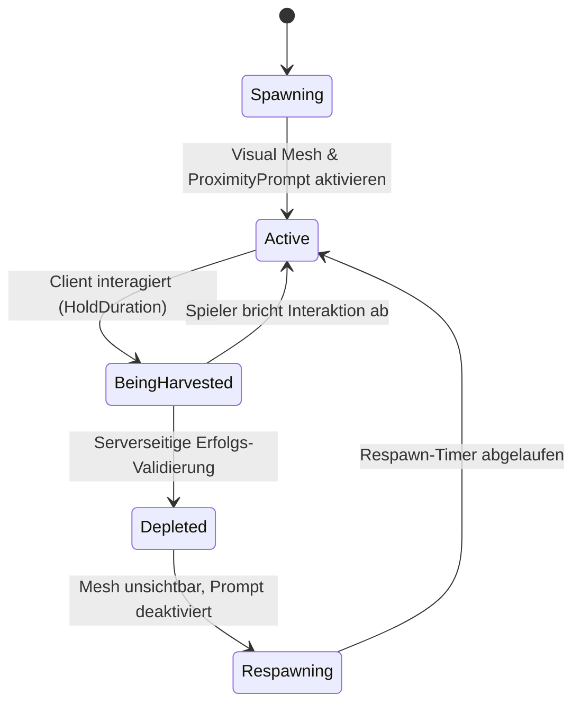
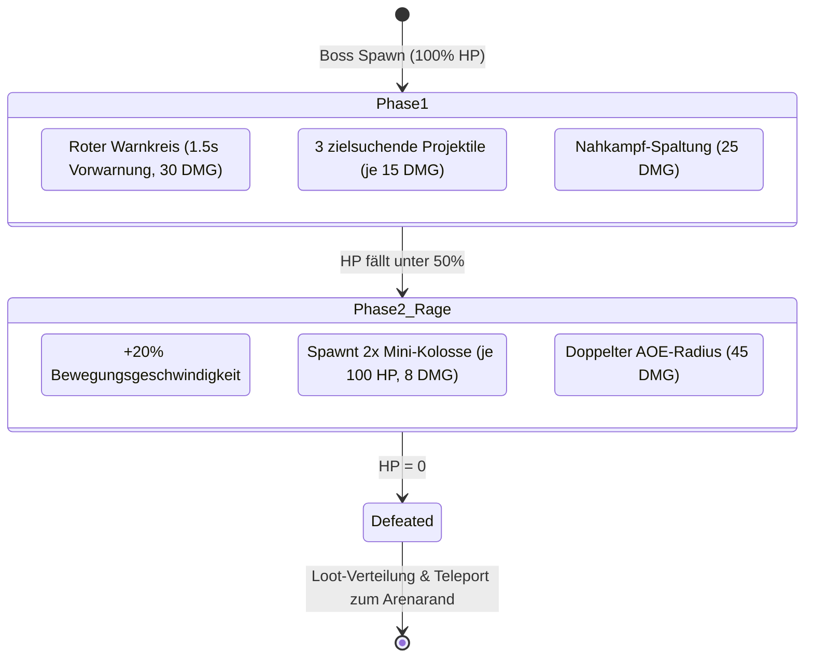
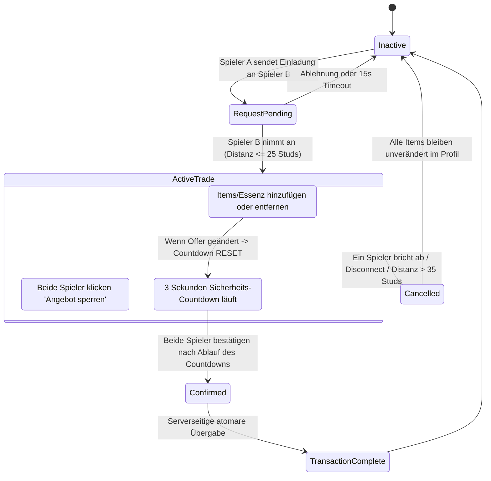

# 🛠️ Aether Alchemist – Vollständige Technische Master-Spezifikation (v2.0)

> **Zweck dieses Dokuments**:  
> Dieses Dokument ist die verbindliche, lückenlose technische Übersetzung des Game-Design-Interviews (`INTERVIEW.md`). Es definiert exakte Datenstrukturen, Service-Architekturen, Netzwerkprotokolle (Remotes), State-Machines, mathematische Formeln und UI-Komponentenbäume, damit die Implementierung ohne Raten, ohne Inkonsistenzen und ohne Runtime-Bugs erfolgen kann.

---

## 📑 Inhaltsverzeichnis
1. [System-Architektur & Service-Grenzen](#1-system-architektur--service-grenzen)
2. [Netzwerk-Protokoll & Remote-Katalog](#2-netzwerk-protokoll--remote-katalog)
3. [Datenspeicher-Architektur (ProfileService v2)](#3-datenspeicher-architektur-profileservice-v2)
4. [Erz- & Harvesting-System (Mining-Engine)](#4-erz---harvesting-system-mining-engine)
5. [Alchemie- & Kessel-Crafting-Engine](#5-alchemie---kessel-crafting-engine)
6. [Kampf-, Waffen- & Buff-System](#6-kampf--waffen---buff-system)
7. [Elementar-Wesen (Begleiter / 2nd Ability)](#7-elementar-wesen-begleiter--2nd-ability)
8. [Mob-KI & Dynamische Boss-Arena (Smart-Scaling-Engine)](#8-mob-ki--dynamische-boss-arena-smart-scaling-engine)
9. [Sicheres Spieler-zu-Spieler Trading-System (2-Phase-Commit)](#9-sicheres-spieler-zu-spieler-trading-system-2-phase-commit)
10. [Zonen-, Barrieren- & Level-Gating-System](#10-zonen--barrieren---level-gating-system)
11. [UI/UX-Architektur & Design-Tokens](#11-uiux-architektur--design-tokens)
12. [Fehlerbehandlung, Session-Recovery & Anti-Exploit-Regeln](#12-fehlerbehandlung-session-recovery--anti-exploit-regeln)

---

## 1. System-Architektur & Service-Grenzen

### 1.1 Verzeichnis- & Modul-Topologie (Rojo Sync)
Um frühere Pfad-Inkonsistenzen zu beenden, gilt eine feste Topologie:

```text
ReplicatedStorage/
├── Config/                  -- Reine Datenmodule (Read-Only für Client & Server)
│   ├── OresConfig.luau      -- Erz-Definitionen, Drops, Respawn-Zeiten, Preise
│   ├── WeaponsConfig.luau   -- Waffen-Tiers, Stats, Buff-Definitionen, Rezepte
│   ├── RecipesConfig.luau   -- Kessel-Rezepte, Zutaten, Output, Verkaufspreise
│   ├── MobsConfig.luau      -- Mob- & Boss-Stats, Drops, XP, Skalierungsformeln
│   ├── SummonsConfig.luau   -- Begleiter-Stats, Cooldowns, Skills
│   └── ZonesConfig.luau     -- Zonenmaße, Spawns, Barrieren, Level-Gating
├── Modules/                 -- Geteilte mathematische & Utility-Module
│   ├── MathUtils.luau       -- Skalierungsformeln, Levelkurven, Easing
│   ├── Signal.luau          -- FastSignal für Event-Driven Programming
│   ├── Janitor.luau         -- Garbage Collection & Resource Management
│   └── UITheme.luau         -- Zentrale Farb-, Font- und Glassmorphism-Tokens
└── Remotes/                 -- Automatisch initialisierte RemoteEvents / RemoteFunctions

ServerScriptService/
├── ServerBootstrapper.server.luau
├── Services/                -- Serverseitige Singletons (Init -> Start Lebenszyklus)
│   ├── DataService.luau     -- ProfileService Integration, Session Locking, Autosave
│   ├── InventoryService.luau-- Transaktionale Item- & Währungsverwaltung
│   ├── HarvestService.luau  -- Mining-Validierung, Node-Spawning, Anti-Cheat
│   ├── AlchemyService.luau  -- Kessel-Crafting, Rezept-Validierung, Buff-Anwendung
│   ├── CombatService.luau   -- Hitbox-Validierung, Schadensberechnung, Waffen-Skills
│   ├── CompanionService.luau-- Begleiter-Spawning, Fähigkeits-Ausführung
│   ├── MobService.luau      -- Server-KI, Mob-Spawning, Aggro, Loot-Verteilung
│   ├── BossService.luau     -- Arena-Sensor, dynamische Skalierung, Phase-Controller
│   ├── TradeService.luau    -- 2-Phase-Commit Handel zwischen Spielern
│   └── ZoneService.luau     -- Spieler-Positionsprüfung, Barrieren-Teleport/Knockback

StarterPlayer/StarterPlayerScripts/
├── ClientBootstrapper.client.luau
└── Controllers/             -- Clientseitige Singletons
    ├── DataController.luau  -- Replizierter Spielerstatus & Client-Cache
    ├── InputController.luau -- Plattform-übergreifendes Input-Mapping (PC/Touch/Pad)
    ├── UIController.luau    -- Fenster-Management, Glassmorphism-Generierung
    ├── HarvestController.luau-- ProximityPrompt-Feedback, Swing-Animationen
    ├── CombatController.luau -- Lokale Animationen, Client-Predict-VFX, Camera-Shake
    ├── CompanionController.luau -- Schulter-Positionierung (RenderStepped), VFX
    ├── BossUIController.luau -- Boss-HP-Leiste, Warnkreis-Rendering, Camera-Zoom
    └── ZoneController.luau  -- Lokale Barriere-Effekte, Warn-UI bei Unterlevelung
```

---

## 2. Netzwerk-Protokoll & Remote-Katalog

Alle Netzwerk-Operationen sind typisiert und validiert. Der Server vertraut niemals unvalidierten Client-Daten.

### 2.1 RemoteFunctions (Request - Response)
| Name | Aufrufer | Payload (Request) | Rückgabe (Response) | Validierungs-Regeln |
| :--- | :--- | :--- | :--- | :--- |
| `HarvestOre_RF` | Client | `nodeId: string` | `{ success: boolean, oreId: string?, amount: number?, error: string? }` | Distanz zum Node $\le 15$ Studs, Node existiert und ist aktiv, Cooldown-Check. |
| `CraftRecipe_RF` | Client | `recipeId: string` | `{ success: boolean, craftedItem: string?, error: string? }` | Spieler steht am Kessel ($\le 18$ Studs), besitzt alle Zutaten, Rezept freigeschaltet. |
| `ConsumePotion_RF` | Client | `potionId: string` | `{ success: boolean, appliedBuff: string?, duration: number?, error: string? }` | Spieler besitzt Trank im Inventar, zieht 1x Trank ab und wendet Buff an. |
| `SellItems_RF` | Client | `items: { [string]: number }` | `{ success: boolean, earnedEssence: number, error: string? }` | Spieler steht am Händler ($\le 18$ Studs), besitzt die angegebenen Items. |
| `EquipWeapon_RF`| Client | `weaponId: string` | `{ success: boolean, equipped: string, error: string? }` | Spieler besitzt Waffe im Inventar. |
| `EquipSummon_RF`| Client | `summonId: string` | `{ success: boolean, equipped: string, error: string? }` | Summon freigeschaltet. |
| `UpgradeSkill_RF`| Client | `treeName: string` | `{ success: boolean, newLevel: number, remainingPoints: number, error: string? }` | `SkillPoints >= 1`, Stufe des Baums < 5 (`Harvester`, `Alchemist`, `Summoner`). |
| `ResetSkills_RF` | Client | None | `{ success: boolean, refundedPoints: number, error: string? }` | Spieler steht am Händler ($\le 18$ Studs), besitzt 100 Essenz Respec-Kosten. |
| `TradeAction_RF`| Client | `action: string, payload: any` | `{ success: boolean, tradeState: table?, error: string? }` | Valide Trade-Session, 3s Scam-Lockout abgelaufen, beide Spieler in Reichweite ($\le 25$ Studs). |


### 2.2 RemoteEvents (Unidirektionale Benachrichtigungen)
| Name | Richtung | Payload | Zweck |
| :--- | :--- | :--- | :--- |
| `SyncProfile_RE` | S $\rightarrow$ C | `fullData: table` | Synchronisiert den gesamten Spielerstand bei Join & Resync. |
| `ProfileDelta_RE` | S $\rightarrow$ C | `path: string, value: any` | Effiziente Delta-Updates (z.B. `"AetherEssence"`, `150`). |
| `UseAbility_RE` | C $\rightarrow$ S | `targetPos: Vector3?` | Triggert die 2nd Ability des ausgerüsteten Begleiters. |
| `AbilityVFX_RE` | S $\rightarrow$ C | `casterPlayer: Player, summonId: string, origin: Vector3, direction: Vector3` | Repliziert Begleiter-VFX/SFX an alle Clients im Umkreis. |
| `AttackSwing_RE`| C $\rightarrow$ S | `attackIndex: number` | Meldet Schwungversuch zur serverseitigen Hitbox-Prüfung. |
| `CombatFeedback_RE` | S $\rightarrow$ C | `{ targetModel: Model, damage: number, isCrit: boolean, isHeal: boolean }` | Zeigt schwebende Schadenszahlen und Blitzeffekte an. |
| `BossState_RE` | S $\rightarrow$ C | `{ state: string, bossName: string, currentHp: number, maxHp: number, phase: number }` | Aktualisiert Boss-HUD, Warnkreise und Musik. |
| `ZoneKnockback_RE` | S $\rightarrow$ C | `{ requiredLevel: number, barrierPosition: Vector3 }` | Löst Rückstoß-Impuls & Level-Hinweis auf dem Client aus. |

---

## 3. Datenspeicher-Architektur (ProfileService v2)

### 3.1 Data-Schema & Typisierung
```luau
export type PlayerProfileData = {
    Version: number,
    Level: number,
    XP: number,
    AetherEssence: number,
    SkillPoints: number,
    Skills: {
        Harvester: number,    -- Stufe 0..5 (+5% Erz-Drop-Chance & Speed pro Punkt)
        Alchemist: number,    -- Stufe 0..5 (+6% Trank-Dauer & Verkaufswert pro Punkt)
        Summoner: number,     -- Stufe 0..5 (-5% Cooldown für 2nd Ability pro Punkt)
    },
    Inventory: {
        Ores: { [string]: number },         -- z.B. EarthTopaz: 12
        Potions: { [string]: number },      -- z.B. InfernoPotion: 3
        Materials: { [string]: number },    -- z.B. ColossusCore: 1
    },
    UnlockedWeapons: { string },             -- IDs freigeschalteter Klingen
    EquippedWeapon: string,                 -- Aktuelle Klingen-ID
    UnlockedSummons: { string },             -- IDs freigeschalteter Begleiter
    EquippedSummon: string,                 -- Aktuelle Begleiter-ID
    ActiveBuffs: {
        [string]: {
            BuffType: string,               -- "DamageBoost", "SpeedBoost", "Shield", "CritBoost", "XpBoost"
            Magnitude: number,              -- z.B. 0.20 (+20%)
            ExpiresAt: number,              -- os.time() Timestamp
        }
    },
    Settings: {
        MusicVolume: number,
        SFXVolume: number,
        CameraShake: boolean,
    },
    Tutorial: {
        Step1MinedOres: number,        -- 0..3 (3x EarthTopaz abbauen)
        Step1Completed: boolean,
        Step2Completed: boolean,       -- 1x Erz beim Händler verkaufen
        Step3Completed: boolean,       -- 1x Kessel-Rezept craften
    },
    Stats: {
        TotalOresMined: number,
        TotalBossesDefeated: number,
        TotalPotionsCrafted: number,
        PlaytimeSeconds: number,
    }
}
```

### 3.2 Standard-Startwerte (Default Profile)
```luau
local DEFAULT_PROFILE: PlayerProfileData = {
    Version = 1,
    Level = 1,
    XP = 0,
    AetherEssence = 100,
    SkillPoints = 0,
    Skills = { Harvester = 0, Alchemist = 0, Summoner = 0 },
    Inventory = {
        Ores = {},
        Potions = {},
        Materials = {},
    },
    UnlockedWeapons = { "BasicBlade" },
    EquippedWeapon = "BasicBlade",
    UnlockedSummons = { "FirePhoenix" },
    EquippedSummon = "FirePhoenix",
    ActiveBuffs = {},
    Settings = { MusicVolume = 0.5, SFXVolume = 0.8, CameraShake = true },
    Tutorial = {
        Step1MinedOres = 0,
        Step1Completed = false,
        Step2Completed = false,
        Step3Completed = false,
    },
    Stats = { TotalOresMined = 0, TotalBossesDefeated = 0, TotalPotionsCrafted = 0, PlaytimeSeconds = 0 },
}
```

### 3.3 XP- & Levelkurve (Mathematische Formel)
- **Level-Cap**: 25
- **Benötigte XP für Level $L \rightarrow L+1$**:
$$\text{RequiredXP}(L) = \lfloor 100 \times (L)^{1.65} \rfloor$$
- **Beispiel-Werte**:
  - Level 1 $\rightarrow$ 2: $100$ XP (5 Erd-Schleim Kills oder 20 Erd-Topas Erze)
  - Level 5 $\rightarrow$ 6: $1.414$ XP
  - Level 10 (Zone 2 Unlock): $4.466$ XP
  - Level 20 (Zone 3 Unlock): $14.058$ XP
  - Level 25 (Max Level): $20.358$ XP

### 3.4 Skill-Points & Skill-Tree Progression
- **Punkte-Vergabe**: Pro Level-Up von Level 1 auf 25 erhält der Spieler exakt **1 Skill-Punkt** (insgesamt 24 Skill-Punkte bei max. 15 Punkten für alle 3 Bäume à 5 Stufen).
- **Skill-Bäume**:
  - `Harvester` (Stufe 0..5): +5% Erz-Drop-Chance & +5% Abbau-Speed pro Stufe.
  - `Alchemist` (Stufe 0..5): +6% Trank-Dauer & +6% Verkaufswert pro Stufe.
  - `Summoner` (Stufe 0..5): -5% Cooldown für Begleiter-Fähigkeit (`2nd Ability`) pro Stufe.
- **Skill-Respec (Punkte zurücksetzen)**:
  - Spieler kann beim Alchemie-Händler NPC über `ResetSkills_RF` für **100 Aether-Essenz** alle verteilten Skill-Punkte zurücksetzen und neu vergeben.


---

## 4. Erz- & Harvesting-System (Mining-Engine)

### 4.1 Erz-Konfigurationsmatrix
| Erz-ID | Element | Seltenheit | Fundort | Respawn | Verkaufspreis | Base Harvest Time | Droprate / Abbau |
| :--- | :--- | :--- | :--- | :--- | :--- | :--- | :--- |
| `EarthTopaz` | Erde | Common | Zone 1 | 12s | 5 Essenz | 1.0s | 1–2 Stück (100%) |
| `FireRuby` | Feuer | Rare | Zone 1 & 2 | 25s | 20 Essenz | 1.5s | 1 Stück (100%) |
| `OceanSapphire` | Wasser | Rare | Zone 1 & 2 | 25s | 20 Essenz | 1.5s | 1 Stück (100%) |
| `WindEmerald` | Wind | Rare | Zone 2 | 25s | 20 Essenz | 1.5s | 1 Stück (100%) |
| `LightningAmethyst`| Blitz | Epic | Zone 2 & 3 | 45s | 60 Essenz | 2.0s | 1 Stück (100%), 10% Chance auf +1 |
| `VoidCrystal` | Void | Mythic | Zone 3 | 90s | 200 Essenz | 3.0s | 1 Stück (100%) |

### 4.2 Mining State-Machine


---

## 5. Alchemie- & Kessel-Crafting-Engine

### 5.1 Kessel-Rezepte & Buff-Matrix
| Rezept-ID | Zutaten | Dauer / Effekt | Verkaufswert Kessel-Bonus (+50%) |
| :--- | :--- | :--- | :--- |
| `InfernoPotion` | `2x FireRuby + 1x WindEmerald` | +20% Angriffs-Schaden (300s) | 90 Essenz |
| `GlacierShield` | `2x OceanSapphire + 1x EarthTopaz` | Absorbiert 100 Schaden (kein Zeitlimit) | 70 Essenz |
| `StormSpeed` | `2x LightningAmethyst + 1x WindEmerald` | +30% WalkSpeed (300s) | 210 Essenz |
| `AetherElixir` | `1x FireRuby + 1x OceanSapphire + 1x VoidCrystal` | +50% XP-Bonus auf alle Aktionen (600s) | 360 Essenz |
| `CosmicEssence` | `2x VoidCrystal + 1x LightningAmethyst` | +15% Krit-Chance (300s) | 690 Essenz |

### 5.2 Waffen-Crafting-Rezepte & Spezifische Mechaniken
| Waffen-ID | Tier | Zutaten | Basisschaden | Spezial-Effekt & Technische Umsetzung |
| :--- | :--- | :--- | :--- | :--- |
| `BasicBlade` | 1 | Keine (Startwaffe) | 10 DMG | Standard-Schlag (Nahkampf-Hitbox 12 Studs). |
| `FireSaber` | 2 | `2x FireRuby` | 25 DMG | **Brand-DoT**: 5 Bonusschaden über 2 Sekunden (2 Ticks à 2.5 DMG im 1.0s Intervall). |
| `OceanTrident` | 3 | `2x OceanSapphire + 1x EarthTopaz` | 45 DMG | **Lebensraub**: Heilt +5 HP pro Treffer (cappt strikt bei 100 Max-HP, keine Überheilung). |
| `StormEdge` | 4 | `3x LightningAmethyst + 1x ColossusCore` | 75 DMG | **Blitz-Schockwelle**: Bei jedem 3. erfolgreichen Schlag 12-Stud AOE Schockwelle. Combo-Counter resettet nach 3.0s Inaktivität. |
| `VoidShadowBlade` | 5 | `3x VoidCrystal + 1x ColossusHeart` | 110 DMG | **Schatten-Blink**: 10-Stud Teleport in Blickrichtung + 20% passive Krit-Chance. **Anti-Noclip-Guard**: Serverseitiger Raycast prüft vor Teleport Hindernisse; stoppt vor Wänden. |

### 5.3 Transaktions-Sicherheit beim Kessel
1. Client sendet `CraftRecipe_RF(recipeId)`.
2. Server sperrt Spieler-Aktion temporär (Mutex Lock).
3. Server prüft:
   - Ist Spieler innerhalb von 18 Studs vom Kessel?
   - Sind alle Rezept-Zutaten in exakter Stückzahl im Profil vorhanden?
4. Atomare Ausführung: Zutaten abziehen, neues Item / Waffe dem Inventar gutschreiben.
5. Server sendet Bestätigung + Sound/Partikel-Event an Client.
6. Mutex Lock aufheben.

---

## 6. Kampf-, Waffen- & Buff-System

### 6.1 Schadens- & Trefferberechnung
Bei einem Waffenschwung meldet der Client den Trefferversuch (`AttackSwing_RE`). Die **serverseitige Validierung** berechnet:

$$\text{FinalDamage} = \text{BaseWeaponDamage} \times (1 + \text{DamageBuffMagnitude}) \times (\text{IsCrit} \,?\, 2.0 : 1.0)$$

- **Kritische Trefferchance**: Basis 5% + ggf. 15% (durch `CosmicEssence`) + ggf. 20% (durch `VoidShadowBlade`).
- **Hitbox-Verifikation**: Server prüft per Spatial-Query (`workspace:GetPartsInPart` oder Raycast), ob der getroffene Mob im Radius von $12$ Studs vor dem Spieler stand. Treffer über 16 Studs Distanz werden verworfen.
- **Lebensraub-Applikation**: Treffer mit `OceanTrident` setzen `Humanoid.Health = math.min(100, Humanoid.Health + 5)`.
- **DoT-Engine**: `CombatService` verwaltet für brennende Mobs Heartbeat-gesteuerte Timertabellen und zieht Ticks atomar ab.

### 6.2 Buff-Manager (Stacking & Timer-Engine)
- Buffs gleicher Art stacken nicht in der Stärke, sondern erneuern die Restdauer (`ExpiresAt = os.time() + Duration`).
- `GlacierShield` besitzt einen absoluten Pool (`ShieldHp = 100`). Eingehender Schaden wird zuerst vom Shield-Pool abgezogen. Fällt der Pool auf 0, verfällt der Buff.
- `AetherElixir` (+50% XP-Bonus) wird direkt im `DataService.AddXP(player, amount * 1.5)` eingerechnet.


---

## 7. Elementar-Wesen (Begleiter / 2nd Ability)

### 7.1 Begleiter-Spezifikation
| Summon-ID | Freischaltung | Cooldown | Taste | 2nd Ability Effekt |
| :--- | :--- | :--- | :--- | :--- |
| `FirePhoenix` | Von Beginn an | 15s | `E` / Touch | **Feuerwelle**: Schießt Flammenkegel (30 Studs Länge, 60° Winkel), 50 Schaden + 10 Verbrennung (2s). |
| `IceGolem` | Besiege Zone 2 Mini-Boss | 25s | `E` / Touch | **Frost-Schild**: Sofortige Aktivierung von 100 Schild-HP + Verlangsamt alle Gegner im 15-Stud-Umkreis um 40% für 4s. |
| `VoidPhantom` | Besiege Zone 3 Hauptboss | 20s | `E` / Touch | **Schatten-Blink**: Teleportiert Spieler 15 Studs in Blickrichtung + hinterlässt Schockwelle mit 75 Schaden. |

### 7.2 Begleiter-Rendering & Physik (Client-Side)
- Begleiter sind reine visuelle `Model`-Instanzen, die auf dem Client per `RunService.RenderStepped` butterweich der rechten Schulter des Spielers folgen:
  - `TargetCFrame = Character.HumanoidRootPart.CFrame * CFrame.new(2.5, 1.8, 1.2) * CFrame.Angles(0, math.sin(time()*3)*0.15, 0)`
- Keine physischen Kollisionen (`CanCollide = false`, `Massless = true`).

---

## 8. Mob-KI & Dynamische Boss-Arena (Smart-Scaling-Engine)

### 8.1 Zonen-Mobs & Werte
| Mob-Name | Zone | HP | Schaden | Aggro-Radius | Drops | XP | Respawn-Zeit |
| :--- | :--- | :--- | :--- | :--- | :--- | :--- | :--- |
| `EarthSlime` | Zone 1 | 50 | 5 | 18 Studs | `EarthTopaz` (100%), 5 Essenz | 20 XP | 15 Sekunden |
| `CrystalCrab` | Zone 2 | 150 | 15 | 22 Studs | `WindEmerald` (70%), `LightningAmethyst` (30%) | 60 XP | 15 Sekunden |
| `CrystalCrabElite` *(Mini-Boss)* | Zone 2 | 250 | 20 | 30 Studs | `LightningAmethyst` (100%), `Summon_IceGolem` (Erstkill) | 150 XP | 45 Sekunden |
| `VoidStalker` | Zone 3 | 350 | 30 | 25 Studs | `VoidCrystal` (100%), 50 Essenz | 180 XP | 15 Sekunden |

### 8.2 Mob-KI State-Machine & Leash-System
- **Aggro-Erkennung**: Prüft per `workspace:GetPartsInPart` alle 0.5s, ob ein Spieler im Aggro-Radius ist.
- **Leash-Guard (45 Studs)**:
  - Jeder Mob besitzt einen festen `SpawnPosition`-Vektor.
  - Entfernt sich der Mob mehr als **45 Studs** von seinem Spawnpunkt (z. B. durch Kiting des Spielers), bricht er die Verfolgung sofort ab.
  - Er wird kurzzeitig unverwundbar, heilt sofort auf **100% HP** und läuft direkt zu seinem Spawnpunkt zurück (`State = Returning`).

### 8.3 Hauptboss: Kristall-Koloss (Zone 3)
- **Basis-Werte**: 500 Base-HP, 25 Base-Schaden.
- **Warteschlangen-Mechanik**:
  - Ein Sensor-Ring (`Radius = 25 Studs`) sammelt wartende Spieler über 60 Sekunden.
  - Sobald der Timer abläuft, werden alle im Ring befindlichen Spieler in die geschlossene Arena teleportiert.
  - Spieler außerhalb des Rings werden ignoriert.

#### Mathematische Boss-Skalierungsformel
$$\text{BossMaxHP} = 500 \times N \times \left(1 + 0.5 \times \frac{\sum_{i=1}^{N} \text{Level}_i}{N}\right)$$
*Beispiel mit 2 Spielern auf Level 20*:
$$\text{BossMaxHP} = 500 \times 2 \times (1 + 0.5 \times 20) = 1000 \times 11 = 11.000 \text{ HP}$$

#### Boss-Phasen & Attack-Patterns


### 8.4 Boss-Loot-Verteilung (Instanced Drops)
Jeder beteiligte Spieler erhält seine eigene, serverseitig ausgewürfelte Belohnung (kein Loot-Stehlen möglich):
- **100% Chance**: 1–3x `ColossusShard` (50 Essenz Wert)
- **40% Chance**: 1x `ColossusCore`
- **15% Chance**: 1x `ColossusHeart`
- **100% Erstkill**: Freischaltung `VoidPhantom` Begleiter + 1.000 XP

---

## 9. Sicheres Spieler-zu-Spieler Trading-System (2-Phase-Commit)

### 9.1 Handelbare Gegenstände & Restriktionen (v1.0 MVP Scope)
- **Handelbar**:
  - `Ores` (Erd-Topas, Feuer-Rubin, Ozean-Saphir, Wind-Smaragd, Blitz-Amethyst, Void-Kristall)
  - `Potions` (Inferno-Trank, Gletscher-Schutz, Sturm-Tempo, Aether-Elixier, Kosmische Essenz)
  - `Materials` (Koloss-Splitter, Koloss-Kern, Koloss-Herzen)
  - `AetherEssence` (Währung)
- **Nicht handelbar (Soulbound / Accountgebunden)**:
  - Alle Waffen (`BasicBlade`, `FireSaber`, `OceanTrident`, `StormEdge`, `VoidShadowBlade`)
  - Alle Begleiter / Summons (`FirePhoenix`, `IceGolem`, `VoidPhantom`)
  - GamePasses & Entwickler-Produkte

### 9.2 Trade State-Machine


---

## 10. Zonen-, Barrieren- & Level-Gating-System

### 10.1 Zonen-Koordinaten & Geometrie
| Zone | Level-Bereich | Boden-Dimensionen | Zentrum-Position | Barrieren-Position | Min. Level |
| :--- | :--- | :--- | :--- | :--- | :--- |
| **Zone 1: Elementar-Wiese** | Level 1–9 | $350 \times 6 \times 350$ Studs | `(0, -3, 0)` | Keine (Spawn-Zone) | 1 |
| **Zone 2: Kristall-Schlucht** | Level 10–19 | $400 \times 15 \times 300$ Studs | `(0, 10, 350)` | `(0, 10, 175)` | 10 |
| **Zone 3: Koloss-Gipfel** | Level 20–25 | $300 \times 40 \times 300$ Studs | `(0, 50, 700)` | `(0, 50, 550)` | 20 |
| **Boss-Arena (Koloss)** | Level 20–25 | $160 \times 4 \times 160$ Studs | `(0, 50, 850)` | Geschlossene Arena-Wände | 20 |

### 10.2 Barrieren-Kollision & Knockback
- Berührt ein Spieler eine Energie-Barriere, prüft der Server:
  $$\text{CanPass} = \text{PlayerLevel} \ge \text{BarrierRequiredLevel}$$
- Ist $\text{CanPass} == \text{false}$:
  - Aufbringen einer linearen Velocity weg von der Barriere: $\vec{v} = -\text{BarrierNormal} \times 35 + \text{Vector3.new}(0, 15, 0)$.
  - Triggern des `ZoneKnockback_RE` mit rotem Screen-Flash und Hinweis: *"Du benötigst Level X, um diese Zone zu betreten!"*.

---

## 11. UI/UX-Architektur & Design-Tokens

### 11.1 Design-Tokens (Verbindliche Spezifikation)
```luau
return {
    Colors = {
        Background = Color3.fromRGB(15, 23, 42),       -- Slate-900 (Obsidian)
        BackgroundTransparency = 0.18,
        Surface = Color3.fromRGB(30, 41, 59),          -- Slate-800
        SurfaceBorder = Color3.fromRGB(212, 175, 55),  -- Antikes Gold
        AccentPrimary = Color3.fromRGB(56, 189, 248),  -- Aether Cyan
        AccentSuccess = Color3.fromRGB(34, 197, 94),  -- Smaragd-Grün
        AccentWarning = Color3.fromRGB(234, 179, 8),  -- Bernstein
        AccentDanger = Color3.fromRGB(239, 68, 68),    -- Rubin-Rot
        TextPrimary = Color3.fromRGB(248, 250, 252),   -- 100% Kontrast
        TextSecondary = Color3.fromRGB(148, 163, 184), -- 70% Kontrast Muted
    },
    Typography = {
        Title = Enum.Font.GothamBold,
        Body = Enum.Font.GothamMedium,
        Numbers = Enum.Font.GothamBold,
    },
    Radii = {
        Panel = UDim.new(0, 14),
        Card = UDim.new(0, 10),
        Button = UDim.new(0, 8),
    },
    Strokes = {
        Panel = 2,
        Card = 1,
        Button = 1.5,
    }
}
```

### 11.2 UI-Komponenten-Baum (Reines Code-Scaffolding)
Keine statischen Binär-Guis! Jedes UI-Fenster wird deterministisch über Komponenten-Factories (`GlassPanel`, `GlassButton`, `ItemCard`, `StatBar`) aufgebaut:
- **Main HUD**:
  - Oben Links: Spieler-Avatar, Level-Badge, XP-Fortschrittsbalken, Aether-Essenz Counter.
  - Unten Mitte: Schnellzugriffs-Leiste (Waffe, Potion-Slots, 2nd Ability Cooldown Icon mit Keybind-Badge `[E]`).
  - Rechts: Aktive Buff-Timer mit dynamischem Count-Down Ring.
- **Modale Fenster (Zentriert)**:
  - `InventoryGui`: Grid-Ansicht mit Filter-Tabs (`Alle`, `Erze`, `Tränke`, `Materialien`), Item-Details & "Benutzen/Ausrüsten"-Aktion.
  - `CauldronGui`: Kessel-Rezeptbuch mit Direkt-Crafting, Zutaten-Vorschau und "Gecraftet"-Glanz-Animation.
  - `MerchantGui`: Schnellverkauf (`Alles verkaufen`, `Ausgewählte verkaufen`) mit automatischer Erlös-Berechnung.
  - `TradeGui`: Split-View mit eigenem und fremdem Angebot, Status-Indikator und 3s-Countdown-Banner.

---

## 12. Fehlerbehandlung, Session-Recovery & Anti-Exploit-Regeln

### 12.1 Server-Autorität & Exploit-Schutz
1. **Kein Client-seitiger Schaden**: Der Client sendet niemals Schadenswerte. Er sendet nur den Angriffstrigger (`AttackSwing_RE`); der Server ermittelt Treffer, Rüstung, Buffs und Schadenshöhe.
2. **Speedhack- & Teleport-Guard**: Positionen bei Interaktionen (Mining, Crafting, Shop) werden serverseitig per Distanzcheck gegen die tatsächliche Serverposition validiert. Maximale ungehinderte Bewegungsgeschwindigkeit: $\le 45$ Studs/s.
3. **Session-Locking**: Verhindert Daten-Duplikation bei schnellem Serverwechsel oder Reconnects über ProfileService.
4. **Auto-Save**: Transaktionale Sicherung alle 30 Sekunden sowie bei `PlayerRemoving` und `BindToClose` (mit 25s Timeout).

### 12.2 Netzwerk-Rate-Limiting (Token-Bucket-Algorithmus)
Jeder Spieler besitzt serverseitig isolierte Token-Buckets für Remotes:
- `AttackSwing_RE`: Max. 12 Tokens / Sekunde (Refill: 12/s).
- `HarvestOre_RF`: Max. 2 Tokens / Sekunde (Refill: 2/s).
- `CraftRecipe_RF` / `SellItems_RF`: Max. 5 Tokens / Sekunde (Refill: 5/s).
- *Überlauf-Verhalten*: Eingehende Pakete oberhalb des Limits werden stillschweigend verworfen (Anti-Lag-Schutz).

### 12.3 Payload-Sanitization & Typ-Wächter
- Alle an `RF` übergebenen Zahlen müssen die Bedingung erfüllen:
  ```luau
  local function isValidPositiveInt(n: any): boolean
      return typeof(n) == "number" and n == math.floor(n) and n > 0 and n <= 100_000 and n ~= math.huge
  end
  ```
- Item-IDs werden strikt gegen die Schlüsseltabellen in `OresConfig`, `WeaponsConfig` und `RecipesConfig` validiert (`Config[id] ~= nil`).

### 12.4 Spieler-Tod & Respawn-Sicherheit
- Bei `Humanoid.Died`:
  - 0 Items/Essenz verloren.
  - Aktive Buffs in `ActiveBuffs` bleiben unverändert gespeichert.
  - Nach 3.0s Respawn am Startplatz in Zone 1 `Vector3.new(0, 5, 0)` mit 100 HP.
  - Befand sich der Spieler in der Boss-Arena, wird er aus der Teilnehmerliste des Bosses ausgetragen und am Arenarand platziert.

---

## 13. Audio-, SFX- & Musik-Architektur

### 13.1 SoundGroups in `SoundService`
- `Master`
  - `BGM` (Volume 0.5): Zonenmusik mit Crossfade (1.5s Tween bei Zonenwechsel).
  - `SFX` (Volume 0.8): 3D-Kollisions-, Mining- & Kampfsounds.
  - `UI` (Volume 0.6): GlassButton Klick- & Hover-Töne.
  - `Ambience` (Volume 0.4): Windrauschen & Höhlenhall.

### 13.2 3D Positional Audio & Pitch Randomization
- Jedes Mining-Klopfen, jeder Waffenschwung und Kessel-Craft erzeugt einen temporären `Sound` am Ziel-Part mit:
  ```luau
  sound.PlaybackSpeed = math.random(92, 108) / 100
  ```

---

## 14. First-Time User Experience (FTUE / Starter-Quest Engine)

### 14.1 Starter-Quest Progression
- **Quest 1 (`Step1`)**: Baue 3x `EarthTopaz` ab. Bei jedem erfolgreichen Mining `Step1MinedOres += 1`. Bei Erreichen von 3: `Step1Completed = true` und +50 Aether-Essenz.
- **Quest 2 (`Step2`)**: Verkaufe 1x beliebiges Erz beim Alchemie-Händler NPC. Bei Transaktion: `Step2Completed = true` und +50 Aether-Essenz.
- **Quest 3 (`Step3`)**: Crafte 1x beliebiges Kessel-Rezept am Alchemie-Podest. Bei Erfolg: `Step3Completed = true` und +50 Aether-Essenz.
- Nach Abschluss aller 3 Quests wird das Tutorial-Panel automatisch ausgeblendet.

---

**Ende der Technischen Master-Spezifikation (v2.1 Final)**  
*Dieses Dokument dient als exakte Richtlinie für alle künftigen Implementierungsschritte.*
